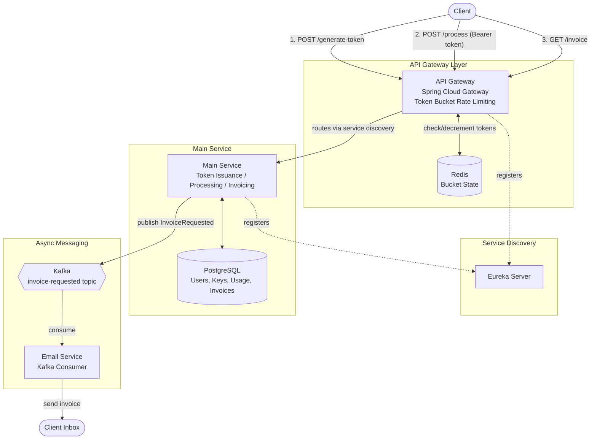

# QuotaGate

A microservices-based API monetization platform that issues tokens, enforces per-client rate limits using the token bucket algorithm, tracks usage, and generates async invoices — modeled after real-world API gateways like Stripe and RapidAPI.

## Overview

QuotaGate simulates how production API platforms manage third-party access: clients get a token tied to a subscription tier (Free / Pro / Enterprise), every request is rate-limited according to that tier, usage is tracked in real time, and clients can pull an invoice summarizing what they've consumed — delivered asynchronously via email.

## Architecture



## How It Works

1. **Generate Token** — client registers and receives a token tied to a tier (Free, Pro, Enterprise), each with its own bucket capacity and refill rate.
2. **Process Request** — client calls the rate-limited endpoint with the token as a bearer credential. The Gateway checks the token bucket in Redis before forwarding the request; Main Service handles it and logs usage.
3. **Get Invoice** — client requests an invoice summarizing requests used and remaining quota. Main Service publishes an event to Kafka, and the Email Service asynchronously sends the invoice without blocking the response.
4. **Quota Alerts** — when a client crosses 80% or 100% of their quota, an alert event is published and an email is sent automatically.

## Services

| Service | Responsibility | Key Tech |
|---|---|---|
| **API Gateway** | Routing, token bucket rate limiting, circuit breaking | Spring Cloud Gateway, Redis, Resilience4j |
| **Main Service** | Token/tier management, request processing, usage logging, invoice generation | Spring Boot, PostgreSQL, Kafka Producer |
| **Email Service** | Async invoice & quota alert delivery | Spring Boot, Kafka Consumer, SMTP |
| **Eureka Server** | Service discovery for all services | Spring Cloud Netflix Eureka |

## Tech Stack

- **Language/Framework:** Java, Spring Boot(3.5.16), Spring Cloud
- **Rate Limiting:** Token bucket algorithm backed by Redis
- **Messaging:** Apache Kafka (async invoice + alert processing)
- **Databases:** PostgreSQL (persistent data), Redis (rate-limit state)
- **Resilience:** Resilience4j (circuit breaker, retry)
- **Service Discovery:** Netflix Eureka
- **Containerization:** Docker, Docker Compose
- **Deployment:** AWS EC2
- **API Testing:** Swagger UI, Postman

## API Endpoints

| Method | Endpoint | Description |
|---|---|---|
| `POST` | `/generate-token` | Registers a client and issues a tier-based access token |
| `POST` | `/process` | Rate-limited business endpoint, requires bearer token |
| `GET` | `/invoice` | Triggers async invoice generation and email delivery |

## Running Locally

```bash
git clone https://github.com/<your-username>/quotagate.git
cd quotagate
docker-compose up --build
```

Services will be available via the API Gateway on `http://localhost:8080`. Swagger UI is exposed at `http://localhost:8080/swagger-ui.html`.

## Roadmap

- [ ] Self-service tier upgrades
- [ ] Idempotency key support on `/process`
- [ ] Admin analytics endpoint
- [ ] Migration path to AWS ECS

## License

MIT