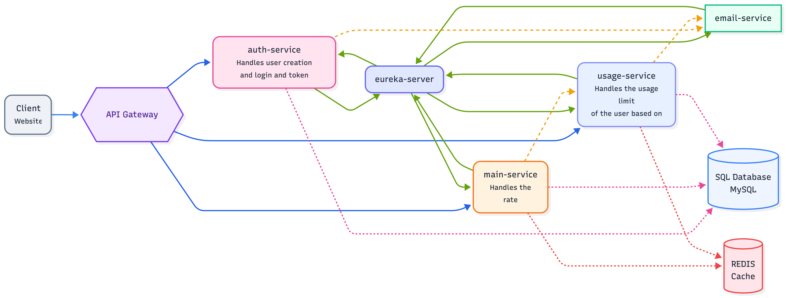

# ApiMeter

A microservices-based API monetization platform that issues tokens, enforces per-client rate limits using **Token Bucket** and **Sliding Window** algorithms, tracks usage, and generates async invoices — modeled after real-world API gateways like Stripe and RapidAPI.

## Overview

ApiMeter simulates how production API platforms manage third-party access: clients get a token tied to a subscription tier (Free / Pro / Enterprise), every request is rate-limited according to that tier, usage is tracked in real time, and clients can pull an invoice summarizing what they've consumed — delivered asynchronously via email.

## Architecture




## How It Works

1. **Generate Token** — client registers and receives a token tied to a tier (Free, Pro, Enterprise), each with its own capacity and refill rate.
2. **Rate Limiting Logic** — ApiMeter supports two robust algorithms backed by Redis:
   - **Token Bucket:** Allows bursts of traffic while maintaining a steady average rate. Tokens are added to the bucket at a fixed rate, and each request consumes a token.
   - **Sliding Window:** Provides precise rate limiting over a rolling time window, preventing sudden spikes at the edge of fixed windows.
3. **Process Request** — client calls the rate-limited endpoint with the token as a bearer credential. The Main Service checks the rate limit state in Redis before processing the request and logging usage.
4. **Inter-Service Communication** — ApiMeter uses **OpenFeign (Feign Client)** for seamless, declarative communication between internal microservices.
5. **Get Invoice** — client requests an invoice summarizing requests used and remaining quota. Main Service publishes an event to Kafka, and the Email Service asynchronously sends the invoice without blocking the response.
6. **Quota Alerts** — when a client crosses 80% or 100% of their quota, an alert event is published and an email is sent automatically.

## Services Overview

Each microservice has its own dedicated `.md` file for independent repository management if needed:

| Service | Responsibility | Key Tech |
|---|---|---|
| **[API Gateway](./api-gateway/README.md)** | Routing, circuit breaking | Spring Cloud Gateway, Resilience4j |
| **[Main Service](./main-service/README.md)** | Rate limiting algorithms (Token Bucket & Sliding Window), Token/tier management, request processing, usage logging | Spring Boot, MySQL, Redis, Kafka Producer, Feign Client |
| **[Auth Service](./auth-service/README.md)** | Authentication & Security | Spring Boot |
| **[Email Service](./email-service/README.md)** | Async invoice & quota alert delivery | Spring Boot, Kafka Consumer, SMTP |
| **[Usage Service](./usage-service/README.md)** | Tracks API usage | Spring Boot |
| **[Eureka Server](./eureka-server/README.md)** | Service discovery for all services | Spring Cloud Netflix Eureka |
| **[Client](./client/README.md)** | Client application | Frontend technologies |

## Tech Stack

- **Language/Framework:** Java, Spring Boot(3.5.16), Spring Cloud
- **Rate Limiting:** Token Bucket & Sliding Window algorithms backed by Redis
- **Inter-Service Communication:** Spring Cloud OpenFeign
- **Messaging:** Apache Kafka (async invoice + alert processing)
- **Databases:** MySQL (persistent data), Redis (rate-limit state)
- **Resilience:** Resilience4j (circuit breaker, retry)
- **Service Discovery:** Netflix Eureka
- **Containerization:** Docker, Docker Compose

## Future Enhancements

- **Kafka Expansion:** Further expand event-driven capabilities using Kafka for webhooks and real-time usage streams.
- **Analytics Dashboard:** Implement a robust analytics module and UI for administrators to track aggregate metrics and for clients to view granular usage insights.

## Running Locally

### Using Docker Compose (Recommended)
To run all services simultaneously with their required databases (MySQL, Redis, Kafka):
```bash
git clone https://github.com/<your-username>/apimeter.git
cd apimeter
docker-compose up --build
```
Services will be available via the API Gateway on `http://localhost:8080`.

### Running Services Separately

If you prefer to run the microservices individually (e.g., for debugging or development):

1. **Configuration:** Each microservice has its own configuration file located at `src/main/resources/application.yaml` (or `.properties`). Before running a service locally, ensure you update the database credentials, Redis host, and Kafka brokers in these files to point to your local instances instead of the Docker network aliases.
2. **Start external dependencies:** Ensure your local MySQL, Redis, and Kafka servers are running.
3. **Run Eureka Server First:** Service discovery must be up before others start.
   ```bash
   cd eureka-server
   mvn spring-boot:run
   ```
4. **Run Other Services:** Navigate into each specific directory and run them. For example:
   ```bash
   cd main-service
   mvn spring-boot:run
   ```
   *Repeat this for `api-gateway`, `auth-service`, `usage-service`, and `email-service`.*

## License

MIT